## Model Context Protocol & Elasticsearch

### By Moncef Abboud
<br></br>
#### cefboud.com
#### Slides: github.com/cefboud/slides

<!-- This is a **note** -->


---
layout: center
---

# What is MCP? 

## Is It a Big Deal or Something?

(Spoiler: Yeah, kinda.)

---

---
layout: image

# the image source
image: ./assets/awesome-mcp-servers.png
backgroundSize: contain
---

---
layout: image

# the image source
image: ./assets/chatgpt-apps.png
backgroundSize: contain
---

---
layout: two-cols
---


# Let's Travel all the way back to 2022

LLMs are **token-only** systems


::right::


## The Problem

- LLMs can only output tokens (text, vision) 
- They can't **execute actions**
- They can't **query databases**
- They can't **search your logs**

<br/>

### What if they could?


---

# ReAct: Reasoning and Acting


#### **Key Insight**: Give LLMs a list of potential actions they can call


```python

#### System Prompt ####

You run in a loop: **Thought → Action → PAUSE → Observation**, then give an **Answer**.
**Thought** explains your reasoning.
**Action** uses one of the tools below, then returns **PAUSE**.
**Observation** is the result of the action.

**Available actions:**

* `calculate:` Run a Python-style calculation (e.g., `calculate: 4 * 7 / 3.0`)
* `get_weather:` Get current weather for a location (e.g., `get_weather: Tokyo`)

Example:
Q: What's 5 times 3?
Thought: I should calculate it.
Action: calculate: 5 * 3
PAUSE

```

* https://til.simonwillison.net/llms/python-react-pattern
---

#  ReAct (2)

**The Process**:

1. LLM outputs action name + input
2. Runtime executes the action
3. Result returned as "observation"
4. LLM continues with new context


---
layout: center
---



<div class="text-center mt-4">


```mermaid {theme: 'neutral', scale: 1}
sequenceDiagram
    participant User
    participant LLM
    participant Runtime
    participant Tool
    
    User->>LLM: "What's the weather in Paris?"
    LLM->>Runtime: Action: get_weather("Paris")
    Runtime->>Tool: Execute get_weather
    Tool-->>Runtime: Result: "Sunny, 22°C"
    Runtime-->>LLM: Observation: "Sunny, 22°C"
    LLM-->>User: "It's sunny and 22°C in Paris!"
```

**This simple idea makes LLMs agentic** ✨


</div>

---

# The Problem with Non-Standardized Tools


Each AI application has its **own format** for tool integration

```python
# App A format
{"action": "search_logs", "params": {"query": "error", "time": "1h"}}

# App B format
<tool name="search_logs"><param name="query">error</param></tool>

# App C format
USE_TOOL(search_logs, query=error, timeframe=1h)
```


**Result**: Every tool needs custom integration for every AI app


---

# The Schema Fragmentation Problem

## Each LLM Provider Has Different Tool Formats

<br/>

<div class="text-center text-2xl">


</div>

<br/>


### The Challenge:
Every tool developer must maintain **N different implementations** of the same tool


---

# OpenAI Function Calling Schema

<div class="grid grid-cols-2 gap-4">

<div>

## Tool Definition

```json
{
  "type": "function",
  "function": {
    "name": "search_elasticsearch",
    "description": "Search Elasticsearch",
    "parameters": {
      "type": "object",
      "properties": {
        "index": {
          "type": "string",
          "description": "Index name"
        },
        "query": {
          "type": "string"
        }
      },
      "required": ["index", "query"]
    }
  }
}
```

</div>

<div>

## API Call

```python
from openai import OpenAI

client = OpenAI()

response = client.chat.completions.create(
  model="gpt-4",
  messages=[
    {"role": "user", 
     "content": "Search for errors"}
  ],
  tools=[tool_definition],
  tool_choice="auto"
)
```

</div>

</div>

<div class="text-sm text-gray-400 mt-4">
Nested structure with "function" wrapper and "parameters" object
</div>

---

# Anthropic (Claude) Tool Schema

<div class="grid grid-cols-2 gap-4">

<div>

## Tool Definition

```json
{
  "name": "search_elasticsearch",
  "description": "Search Elasticsearch",
  "input_schema": {
    "type": "object",
    "properties": {
      "index": {
        "type": "string",
        "description": "Index name"
      },
      "query": {
        "type": "string"
      }
    },
    "required": ["index", "query"]
  }
}
```

</div>

<div>

## API Call

```python
import anthropic

client = anthropic.Anthropic()

response = client.messages.create(
  model="claude-3-5-sonnet-20241022",
  max_tokens=1024,
  messages=[
    {"role": "user", 
     "content": "Search for errors"}
  ],
  tools=[tool_definition]
)
```

</div>

</div>

<div class="text-sm text-gray-400 mt-4">
Flatter structure with "input_schema" instead of "parameters"
</div>

---

# Google (Gemini) Function Schema

<div class="grid grid-cols-2 gap-4">

<div>

## Tool Definition

```json
{
  "name": "search_elasticsearch",
  "description": "Search Elasticsearch",
  "parameters": {
    "type": "object",
    "properties": {
      "index": {
        "type": "string",
        "description": "Index name"
      },
      "query": {
        "type": "string"
      }
    },
    "required": ["index", "query"]
  }
}
```

</div>

<div>

## API Call

```python
import google.generativeai as genai

model = genai.GenerativeModel(
  'gemini-1.5-pro',
  tools=[tool_definition]
)

response = model.generate_content(
  "Search for errors"
)
```

</div>

</div>

<div class="text-sm text-gray-400 mt-4">
Similar to OpenAI but without the "function" wrapper, uses "parameters" directly
</div>

---
layout: two-cols
---

# Schema Differences Summary

<div class="text-sm">

| Provider | Wrapper | Args Key | Other Differences |
|----------|---------|----------|-------------------|
| **OpenAI** | `function` object | `parameters` | Nested structure |
| **Claude** | None | `input_schema` | Flat structure |
| **Gemini** | None | `parameters` | Similar to OpenAI |

</div>

::right::


## The Problem

```python
# Without a standard, you need:

def tool_for_openai():
    return {"type": "function", ...}

def tool_for_claude():
    return {"name": ..., "input_schema": ...}

def tool_for_gemini():
    return {"name": ..., "parameters": ...}
```

<div class="text-red-400 font-bold mt-4">
3× the code, 3× the bugs, 3× the maintenance
</div>


---

# Enter MCP

## Model Context Protocol


An **agreed-upon standard** for AI applications and tools to communicate

<br/>

### Think of it like:
- **HTML + HTTP** for the web
- **JDBC/ODBC** for databases

<br/>

*One standard. Universal compatibility.*

<!-- Each AI app needs a way to list tools, call tools, be notified of changes, MCP takes care of that.  -->


---

# MCP = Interoperability

<div class="grid grid-cols-2 gap-4">

<div>

## Without MCP


<div class="text-sm text-red-400">
N×M integrations needed
</div>

</div>

<div>

## With MCP


<div class="text-sm text-green-400">
Plug and play compatibility
</div>

</div>

</div>


---


# The Three Participants


 🔷 MCP Host: Claude Desktop, VS Code, your future AI coworker

 🟢 MCP Client: 1 per MCP server, Bridges host ↔ server. 

 🟠 MCP Server: **Elasticsearch**, Figma, Github, any service with an MCP API


---

### MCP Protocol Flow


---

# MCP's Two Layers

<div class="grid grid-cols-2 gap-8">

<div>

## 📦 Data Layer (Inner)

**What** messages are exchanged


**Messages like:**
- `tools/list` - Get available tools
- `tools/call` - Execute a tool
- `resources/list` - Get resources
- Session initialization

</div>

<div>

## 🚚 Transport Layer (Outer)

**How** messages are transmitted and exchanged.


</div>

</div>

---
layout: two-cols
---

## JSON-RPC

**JSON Remote Procedure Call** 


```json
// Client Request
{
  "jsonrpc": "2.0",
  "method": "subtract",
  "params": { "minuend": 42, "subtrahend": 23 },
  "id": 1
}

// Server Response  
{
  "jsonrpc": "2.0",
  "result": 19,
  "id": 1
}
```

- Method name + parameters
- Requests have IDs (mapped to responses)
- Multiple requests can be in flight
- **Notifications** have no ID (no response expected)


::right::

## JSON-RPC Notifications

**Fire-and-forget messages** with no ID

```json
{
  "jsonrpc": "2.0",
  "method": "notifications/tools/list_changed"
}
```

-  Initialization complete
-  Tools list updated  
-  Status changes
-  Log messages


---
layout: two-cols
---

# Transport Layer

## 💻 Standard I/O

**For local servers**


- Same machine
- Fast & secure
- No network needed
- Process communication

::right::

<br></br>

## 🌐 Streamable HTTP

**For remote servers**


- Over the network
- HTTP POST for client-to-server messages
- SSE for streaming and server notifications


---


# MCP Primitives

The building blocks of functionality

---

# Server Primitives

**What MCP Servers offer to Clients**

## 🔧 Tools
**Actions/Functions** 
Server operations with names, descriptions, parameters, and results.

## 📚 Resources  
**Context Data** to enrich LLM understanding
Files, databases, or documents that enrich LLM context.
## 📝 Prompts
**Packaged Workflows** and best practices
Packaged workflows for guided task execution with built-in expertise.

---


# Client Primitives

**What MCP Clients offer to Servers**


## 🤖 Sampling

LLM calls are made by the client on demand; server requests and user approves each interaction for control and transparency.

## 💬 Elicitation

Server engages the user to fill in gaps—confirm actions, provide missing data, or set preferences before proceeding.

---

# Security

**Critical for remote servers and your ES cluster!**


MCP emphasizes security with multiple authentication schemes:

```http
Authorization: Bearer <token>
Authorization: ApiKey <elasticsearch-api-key>  
Authorization: Basic <base64-credentials>
```

<br/>

**For Elasticsearch MCP Server:**
- `ES_API_KEY` - Recommended approach
- `ES_USERNAME` + `ES_PASSWORD` - Basic auth

---

# OAuth2.1

Latest MCP authorization relies builds on top of OAuth2

* Authorization Server Metadata (RFC8414)
* Dynamic Client Registration Protocol (RFC7591)
* Protected Resource Metadata (RFC9728)
* Resource Indicator (RFC8707)

---

# Elasticsearch MCP in Action

Live demo time!

---

# Introducing Elastic's MCP Server

**Official implementation** from Elastic


```bash
# Docker image
docker.elastic.co/mcp/elasticsearch

# Supports MCP protocols
- stdio (local)
- SSE (deprecated)  
- streamable-HTTP (recommended)

# Elasticsearch versions
- 8.x ✅ Officially supported
- 9.x ✅ Officially supported
- 7.x ⚠️ May work, no guarantees
```

**Status**: ⚠️ EXPERIMENTAL (but fully functional!)


---

# Setup: Docker Command

**Running the Elasticsearch MCP Server**


```bash
# For stdio mode (local)
docker run -i --rm \
  -e ES_URL="https://my-cluster.es.io:9200" \
  -e ES_API_KEY="your-api-key-here" \
  docker.elastic.co/mcp/elasticsearch \
  stdio

# For HTTP mode (remote)
docker run --rm \
  -e ES_URL="https://my-cluster.es.io:9200" \
  -e ES_API_KEY="your-api-key-here" \
  -p 8080:8080 \
  docker.elastic.co/mcp/elasticsearch \
  http
```

**Environment Variables:**
- `ES_URL` - Your cluster URL
- `ES_API_KEY` - API key (recommended) or...
- `ES_USERNAME` + `ES_PASSWORD` - Basic auth


---

# Claude Desktop Configuration

**Connecting Claude to Elasticsearch**

```json
{
  "mcpServers": {
    "elasticsearch": {
      "command": "docker",
      "args": [
        "run", "-i", "--rm",
        "-e", "ES_URL",
        "-e", "ES_API_KEY",
        "docker.elastic.co/mcp/elasticsearch",
        "stdio"
      ],
      "env": {
        "ES_URL": "https://my-cluster.es.io:9200",
        "ES_API_KEY": "VnVhQ2ZHY0JDZGJrU..."
      }
    }
  }
}
```


**Location**: `~/Library/Application Support/Claude/claude_desktop_config.json`

Restart Claude Desktop and you're ready! 🚀


---

# The Complete Exchange Flow


---
layout: two-cols
---


# Real Example: Initialization

**Step 1: Client initializes session**

```json
{
  "jsonrpc": "2.0",
  "method": "initialize",
  "id": 1,
  "params": {
    "protocolVersion": "2025-06-18",
    "capabilities": {
      "roots": { "listChanged": true },
      "sampling": {}
    },
    "clientInfo": {
      "name": "Claude Desktop",
      "version": "0.7.4"
    }
  }
}
```

::right::
<br></br>
<br></br>
<br></br>


 **Server responds:**
```json
{
  "jsonrpc": "2.0",
  "id": 1,
  "result": {
    "protocolVersion": "2025-06-18",
    "capabilities": {
      "tools": { "listChanged": true },
      "resources": {}
    },
    "serverInfo": {
      "name": "elasticsearch-mcp-server",
      "version": "0.4.0"
    }
  }
}
```


---

# Real Example: Getting Tools

**Step 2: Client requests available tools**

```json
{
  "jsonrpc": "2.0",
  "method": "tools/list",
  "id": 2
}
```

---

#  Real Example: Getting Tools (2)

**Server responds with tool definitions:**
```json
{
  "jsonrpc": "2.0",
  "id": 2,
  "result": {
    "tools": [
      {
        "name": "list_indices",
        "description": "List all available Elasticsearch indices",
        "inputSchema": { "type": "object", "properties": {} }
      },
      {
        "name": "search",
        "description": "Perform an Elasticsearch search",
        "inputSchema": {
          "type": "object",
          "properties": {
            "index": { "type": "string" },
            "body": { "type": "object" }
          },
          "required": ["index", "body"]
        }
      }
      // ... more tools
    ]
  }
}
```


---

# Real Example: User Query

**User asks**: "Show me error logs from the last hour"


**Step 3: LLM decides to list indices first**
```json
{
  "jsonrpc": "2.0",
  "method": "tools/call",
  "id": 3,
  "params": {
    "name": "list_indices"
  }
}
```

**Response:**
```json
{
  "jsonrpc": "2.0",
  "id": 3,
  "result": {
    "content": [
      { "index": "app-logs", "status": "open","docs.count": 12},
      { "index": "products", "status": "open", "docs.count": 13}
    ]
  }
}
```

---

# Key Takeaways


1. **MCP is a protocol** - like HTTP/HTML for AI tools
2. **Two layers**: Data (JSON-RPC) + Transport (stdio/HTTP)
3. **Three participants**: Host (Claude) → Client → Server (Elasticsearch)
4. **Primitives**: Tools, Resources, Prompts / Sampling, Elicitation,
5. **Elasticsearch MCP is neat** -Talk to your ES using natural language. Unlock agentic workflows.
6. **Powerful capabilities** - search, ES|QL, mappings.

<br></br>

### **Get in touch:**  cefboud.com
## --
### **Slides:** github.com/CefBoud/slides